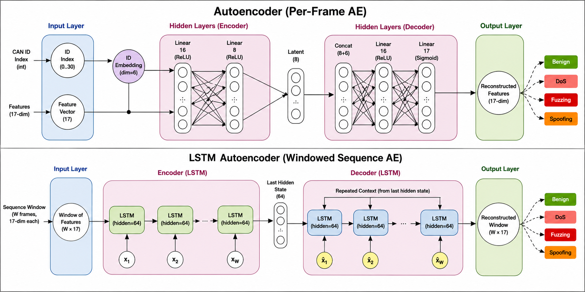

# Unsupervised CAN Bus Intrusion Detection with a Windowed LSTM Autoencoder

Unsupervised anomaly detection for in-vehicle **CAN bus** traffic. A **windowed LSTM autoencoder** and a **per-frame feedforward autoencoder (AE)** are trained only on *normal* traffic and flag frames/windows whose reconstruction error or inter-arrival timing deviates from normal. Evaluated on the **can-train-and-test** dataset (Chevrolet Impala / Silverado / Traverse, Subaru Forester) under cross-vehicle and cross-attack domain shift. This report covers the LSTM trained with window sizes **4, 8, and 16** and the per-frame AE, compared at matching granularity (frame level) and at each model's native granularity (window level for the LSTM).

## 1. The Problem

Modern vehicles are controlled by 50-100 **ECUs** (Electronic Control Units: engine, brakes, airbags, infotainment...) that exchange messages over the **Controller Area Network (CAN) bus**. CAN was standardized in the 1980s for a closed, trusted environment, so it provides **no authentication, no encryption, and no source addressing** — every node broadcasts to everyone, and any node can claim any message ID.

An attacker who gains access to the in-vehicle network (via the OBD-II port, a compromised ECU, or a wireless attack surface such as Bluetooth/telematics) can therefore **inject malicious frames**:

- **DoS**: flood a dominant ID to starve legitimate traffic.
- **Fuzzing / Fuzzy**: random payloads to crash ECUs.
- **Spoofing**: forge safety-critical signals (engine RPM, gear position, vehicle speed, brakes), e.g. *force-neutral*, *rpm*, *standstill* attacks.

## 2. What is a CAN Frame?

A CAN data frame is a short broadcast message:

| Field | Meaning |
|-------|---------|
| **Arbitration ID** | identifies the message type and bus priority (11-bit standard / 29-bit extended) |
| **DLC** | Data Length Code: how many of the 8 payload bytes are used (0-8) |
| **Payload (8 bytes)** | the actual signal data; unused bytes are ignored |
| **Timestamp** | arrival time (micro/ms) of the frame |

Two properties make frames learnable:

1. **Periodicity** — each ID transmits at a stable cadence (e.g. every 20-100 ms). A DoS flood compresses inter-arrival gaps toward zero; a spoofed-but-normal-cadence attack still changes the payload.
2. **Payload stability** — for a given ID, bytes change slowly and predictably. A replayed/frozen payload shows near-zero byte deltas; a random (fuzzed) payload shows abnormally large deltas.

Our model uses both signals. Per frame we build a **17-dim feature vector**, all normalized to `[0,1]`:

| Dims | Feature | Signal |
|------|---------|--------|
| 0 | expected_period | ID's training-normal median inter-arrival (ms), capped |
| 1 | typical_dlc | mode of the ID's DLC / 8 |
| 2 | payload_variance | mean per-byte std (byte stability) |
| 3 | frequency_rank | log-frequency of the ID in training |
| 4-11 | byte_0 ... byte_7 | the 8 payload bytes / 255 |
| 12 | dlc | DLC / 8 |
| 13-14 | byte_delta_mean, byte_delta_std | change vs. previous same-ID frame (freeze signal) |
| 15-16 | gap_lo, gap_hi | inter-arrival gap vs. the ID's median period (timing signal) |

Stats are fit on **training-normal frames only**; unseen IDs fall back to global-average stats. All temporal features (byte deltas, gaps, LSTM windows) are computed **within one recording session** — the merged CSV interleaves independent recordings that share the same epoch base, so cross-session stitching is forbidden.

## 3. Metrics

Attack frames are a tiny minority (e.g. ~63k attack vs ~5.6M normal frames in test set 01), so **accuracy is meaningless** — a detector that flags nothing scores 98.9% accuracy. We evaluate with class-imbalance-aware metrics at **both granularities** used in this report:

- **PR-AUC** (Area under the Precision-Recall curve): threshold-independent; the primary ranking metric. Higher = attacks rank above normals. Random guessing ≈ attack prevalence (≈ 0.01-0.05 here), so PR-AUC values should be read against that baseline.
- **Precision** = TP / (TP + FP): of the flagged windows, how many really are attacks. Low precision = many false alarms (annoying in production).
- **Recall** = TP / (TP + FN): of the actual attack windows, how many we catch. High recall = few attacks missed (safety-critical).
- **F1** = harmonic mean of Precision and Recall.
- **Timing heuristic (supplementary)**: a window is flagged if its **min gap-ratio** (min over frames of `gap_lo` & `gap_hi`, normal ≈ 1, flood/gap → 0) is below a threshold calibrated as the **p1/p5 percentile of validation-normal windows** (no test leakage). Reported at both thresholds (p1 stricter, p5 looser).

**Window-level vs frame-level granularity.** The LSTM is windowed (one error per W-frame window), so its default numbers are **window-level** — a window is *attack* if it contains ≥ 1 attack frame, and the window error is a mean over W×F values, which **dilutes** a short attack burst. The per-frame feedforward AE scores **every frame individually**, so its PR-AUC is computed on a different unit and is **not directly comparable** to the LSTM's window-level PR-AUC. To make a fair apples-to-apples comparison, the LSTM is *also* scored at **frame level** via a causal sliding window (stride 1): `score[t]` = reconstruction error of the W-frame window ending at `t`. First W-1 frames of each session have no full window and are excluded. **Compare the AE only against the `lstm_frame` column.**

Two detectors are reported per test set, kept as separate tiers:
1. **Reconstruction-based (primary, architecture comparison)** — three views compared head-to-head on PR-AUC: **LSTM (window-level)**, **LSTM (frame-level, causal sliding window)**, and **AE (frame-level)**. The LSTM window-level view is its native operating mode; the two frame-level views are the apples-to-apples comparison.
2. **Timing heuristic (supplementary, lightweight)** — a simple gap-ratio rule, framed as a complementary signal, not a competing architecture. Recall near 1.0 by design on timing attacks, at the cost of precision.

## 4. Results

### Model architectures

Two autoencoders are compared. Both are trained **only on normal frames** and score inputs by reconstruction error (MSE), so novel/attack patterns produce larger errors.

**Per-frame feedforward AE (`Autoencoder`)** — scores each frame independently (no temporal context). The 17-dim feature vector is concatenated with a learned 6-dim CAN-ID embedding, compressed by the encoder to an 8-dim bottleneck, then decoded back to 17 dims with the embedding concatenated again; a Sigmoid keeps the reconstruction in `[0,1]`.

**Windowed LSTM AE (`LSTMAutoencoder`)** — processes a window of `W` consecutive frames (`W` = 4/8/16, one window per session). An encoder LSTM (hidden 64, 1 layer) compresses the `(W, 17)` window into a hidden state; the decoder LSTM reconstructs the whole window from that state repeated over `W` steps; the window error is the MSE over all `W × 17` values.



### Setup

- Models: `LSTMAutoencoder` (encoder LSTM → latent hidden state → decoder LSTM, hidden 64, 1 layer, 17-dim input, non-overlapping per-session windows) and a per-frame `Autoencoder` (per-ID embedding → bottleneck(8) → 17-dim reconstruction, scored frame-by-frame).
- Both trained on **set_01 train_01 normal frames only** (Chevrolet Impala), val = per-session last 20%, 99th-percentile recon threshold, early stopping (patience 10). No attack labels used.
- Test sets: **test_01** (known vehicle, known attacks), **test_02** (unknown vehicle, known attacks), **test_03** (known vehicle, unknown attacks), **test_04** (unknown vehicle, unknown attacks).

| Model | Best epoch | Val loss | Recon threshold | Timing thresholds (p1/p5) |
|-------|-----------|----------|-----------------|---------------------------|
| LSTM W=4 | 155 | 0.014052 | 0.032706 | 0.7492 / 0.8293 |
| LSTM W=8 | 195 | 0.022396 | 0.041313 | 0.7236 / 0.8073 |
| LSTM W=16 | 99 | 0.032869 | 0.048522 | 0.7045 / 0.7576 |
| AE (frame) | 28 | 0.000518 | 0.002785 | — |

### Primary tier — reconstruction-based detector (architecture comparison)

Head-to-head PR-AUC / F1 across the three views: **LSTM (window-level)**, **LSTM (frame-level, causal sliding window)**, and **AE (frame-level)**. The two frame-level views are the apples-to-apples comparison; the LSTM window-level view is its native operating mode.

**Overall:**

| Test set | LSTM W=16 (window) | LSTM W=16 (frame) | AE (frame) |
|----------|--------------------|-------------------|------------|
| test_01 (known veh, known att) | 0.5961 / 0.5826 | 0.3833 / 0.4234 | **0.8262 / 0.6248** |
| test_02 (unknown veh, known att) | 0.0988 / 0.1474 | 0.0304 / 0.0498 | 0.0554 / 0.0609 |
| test_03 (known veh, unknown att) | 0.0604 / 0.0567 | 0.0062 / 0.0188 | **0.9224 / 0.2878** |
| test_04 (unknown veh, unknown att) | 0.0169 / 0.0149 | 0.0054 / 0.0023 | 0.0177 / 0.0039 |

**Per attack type — PR-AUC:**

*test_01 — known vehicle, known attacks* (frames: normal=5,639,390 | attack=63,280; DoS 55,369, rpm 3,921, force-neutral 2,491, standstill 1,499):

| Attack type | LSTM (window) | LSTM (frame) | AE (frame) |
|-------------|---------------|--------------|------------|
| DoS | **0.8273** | 0.4234 | 0.8191 |
| rpm | 0.0173 | 0.0028 | **0.2181** |
| force-neutral | 0.0055 | 0.0010 | **0.1635** |
| standstill | 0.0044 | 0.0002 | **0.0373** |

*test_02 — unknown vehicle, known attacks* (frames: normal=6,283,750 | attack=164,167; DoS 163,576, standstill 351, rpm 152, force-neutral 88):

| Attack type | LSTM (window) | LSTM (frame) | AE (frame) |
|-------------|---------------|--------------|------------|
| DoS | **0.0978** | 0.0303 | 0.0555 |
| standstill | 0.0009 | 0.0000 | 0.0000 |
| rpm | 0.0004 | 0.0000 | 0.0000 |
| force-neutral | 0.0002 | 0.0000 | 0.0000 |

*test_03 — known vehicle, unknown attacks* (frames: normal=8,614,450 | attack=20,825; fuzzing 5,975, speed 5,321, interval 4,418, triple 2,776, double 1,292, systematic 1,043):

| Attack type | LSTM (window) | LSTM (frame) | AE (frame) |
|-------------|---------------|--------------|------------|
| interval | 0.0174 | 0.0008 | **0.8854** |
| fuzzing | 0.0207 | 0.0011 | **0.8526** |
| speed | 0.0197 | 0.0052 | **0.8424** |
| triple | 0.0055 | 0.0007 | **0.3971** |
| double | 0.0034 | 0.0003 | **0.2265** |
| systematic | 0.0025 | 0.0001 | **0.1584** |

*test_04 — unknown vehicle, unknown attacks* (frames: normal=13,206,311 | attack=14,244; fuzzing 6,315, speed 3,205, double 1,891, triple 1,719, systematic 981, interval 133):

| Attack type | LSTM (window) | LSTM (frame) | AE (frame) |
|-------------|---------------|--------------|------------|
| fuzzing | 0.0118 | 0.0050 | **0.0253** |
| speed | 0.0067 | 0.0015 | 0.0005 |
| systematic | 0.0016 | 0.0001 | **0.0502** |
| double | 0.0016 | 0.0002 | 0.0002 |
| triple | 0.0013 | 0.0002 | 0.0004 |
| interval | 0.0002 | 0.0000 | 0.0000 |

> **Reading the primary tier.** On the *known* vehicle, the frame-level AE is the strongest reconstruction detector on every attack family (test_01 PR-AUC 0.83, test_03 PR-AUC 0.92) — it scores each frame directly and reconstructs the per-frame gap/byte-delta features. But its **F1 lags its PR-AUC** (test_03: PR-AUC 0.92 yet F1 0.29): excellent ranking, poorly calibrated 99th-pct threshold. The LSTM is *better than the AE* only at its native **window** granularity for DoS (0.827 vs 0.819) and, generally, window-level LSTM beats frame-level LSTM — averaging the window dilutes the per-frame ranking gain. On the *unknown* vehicle (test_02/test_04) all three collapse to near-random; per-ID behavior does not transfer across vehicle architectures.

### Supplementary tier — timing heuristic (lightweight, not a competing architecture)

A simple gap-ratio rule (`min` over frames of `gap_lo`/`gap_hi` < threshold, calibrated at the p1/p5 percentile of validation-normal windows) — reported separately because it is a cheap complementary signal, not a learned detector competing with the primary tier. W=16 shown (thresholds p1 = 0.7045, p5 = 0.7576):

**test_01 — known vehicle, known attacks:**

| Attack type | Prec(p1) | Rec(p1) | F1(p1) | Prec(p5) | Rec(p5) | F1(p5) | N (windows) |
|-------------|----------|---------|--------|----------|---------|--------|-----|
| DoS | 0.6773 | 1.0000 | **0.8076** | 0.2948 | 1.0000 | 0.4554 | 7,355 |
| rpm | 0.3009 | 0.9921 | 0.4617 | 0.0792 | 0.9954 | 0.1467 | 1,520 |
| standstill | 0.2793 | 0.9372 | 0.4304 | 0.0729 | 0.9545 | 0.1354 | 1,449 |
| force-neutral | 0.2239 | 0.9990 | 0.3658 | 0.0544 | 1.0000 | 0.1032 | 1,012 |

**test_02 — unknown vehicle, known attacks:**

| Attack type | Prec(p1) | Rec(p1) | F1(p1) | Prec(p5) | Rec(p5) | F1(p5) | N (windows) |
|-------------|----------|---------|--------|----------|---------|--------|-----|
| DoS | 0.0779 | 1.0000 | 0.1446 | 0.0779 | 1.0000 | 0.1446 | 31,350 |
| standstill | 0.0009 | 1.0000 | 0.0019 | 0.0009 | 1.0000 | 0.0019 | 351 |
| rpm | 0.0004 | 1.0000 | 0.0008 | 0.0004 | 1.0000 | 0.0008 | 152 |
| force-neutral | 0.0002 | 1.0000 | 0.0005 | 0.0002 | 1.0000 | 0.0005 | 88 |

**test_03 — known vehicle, unknown attacks:**

| Attack type | Prec(p1) | Rec(p1) | F1(p1) | Prec(p5) | Rec(p5) | F1(p5) | N (windows) |
|-------------|----------|---------|--------|----------|---------|--------|-----|
| interval | 0.5019 | 1.0000 | **0.6684** | 0.1675 | 1.0000 | 0.2870 | 4,418 |
| fuzzing | 0.4757 | 0.6694 | 0.5561 | 0.1555 | 0.6802 | 0.2531 | 5,941 |
| speed | 0.2863 | 1.0000 | 0.4452 | 0.0742 | 1.0000 | 0.1381 | 1,759 |
| triple | 0.2092 | 0.9991 | 0.3460 | 0.0502 | 0.9991 | 0.0956 | 1,161 |
| double | 0.1443 | 1.0000 | 0.2521 | 0.0326 | 1.0000 | 0.0631 | 739 |
| systematic | 0.0075 | 0.0316 | 0.0121 | 0.0023 | 0.0479 | 0.0043 | 1,043 |

**test_04 — unknown vehicle, unknown attacks:**

| Attack type | Prec(p1) | Rec(p1) | F1(p1) | Prec(p5) | Rec(p5) | F1(p5) | N (windows) |
|-------------|----------|---------|--------|----------|---------|--------|-----|
| fuzzing | 0.0017 | 1.0000 | 0.0035 | 0.0017 | 1.0000 | 0.0035 | 1,424 |
| speed | 0.0017 | 1.0000 | 0.0034 | 0.0017 | 1.0000 | 0.0034 | 1,385 |
| double | 0.0014 | 1.0000 | 0.0028 | 0.0014 | 1.0000 | 0.0028 | 1,130 |
| systematic | 0.0012 | 0.9990 | 0.0024 | 0.0012 | 0.9990 | 0.0024 | 974 |
| triple | 0.0009 | 1.0000 | 0.0019 | 0.0009 | 1.0000 | 0.0019 | 769 |
| interval | 0.0002 | 1.0000 | 0.0003 | 0.0002 | 1.0000 | 0.0003 | 133 |

### LSTM window-size comparison (16 vs 8 vs 4) — window-level only

The LSTM at its native granularity (per-window reconstruction), across window sizes. Frame-level and AE views are deliberately excluded here — this is purely about how much temporal context the windowed LSTM wants.

**Overall (window-level PR-AUC / F1):**

| Test set | W=4 | W=8 | W=16 |
|----------|-----|-----|------|
| test_01 (known veh, known att) | 0.5542 / 0.5579 | 0.4401 / 0.4965 | **0.5961 / 0.5826** |
| test_02 (unknown veh, known att) | 0.0923 / 0.1323 | **0.1023 / 0.1480** | 0.0988 / 0.1474 |
| test_03 (known veh, unknown att) | **0.1281 / 0.2123** | 0.0723 / 0.0875 | 0.0604 / 0.0567 |
| test_04 (unknown veh, unknown att) | 0.0065 / 0.0097 | 0.0104 / 0.0129 | **0.0169 / 0.0149** |

**Reconstruction PR-AUC per attack type:**

*test_01:*

| Attack type | W=4 | W=8 | W=16 |
|-------------|------|------|------|
| DoS | 0.6260 | 0.5275 | **0.8273** |
| rpm | 0.0164 | 0.0180 | 0.0173 |
| force-neutral | 0.0115 | 0.0071 | 0.0055 |
| standstill | 0.0025 | 0.0029 | 0.0044 |

*test_02:*

| Attack type | W=4 | W=8 | W=16 |
|-------------|------|------|------|
| DoS | 0.0921 | **0.1019** | 0.0978 |
| standstill | 0.0002 | 0.0004 | **0.0009** |
| rpm | 0.0001 | 0.0002 | **0.0004** |
| force-neutral | 0.0000 | 0.0001 | **0.0002** |

*test_03:*

| Attack type | W=4 | W=8 | W=16 |
|-------------|------|------|------|
| fuzzing | **0.0684** | 0.0234 | 0.0207 |
| interval | **0.0382** | 0.0272 | 0.0174 |
| speed | **0.0355** | 0.0179 | 0.0197 |
| triple | **0.0108** | 0.0066 | 0.0055 |
| double | 0.0037 | 0.0037 | 0.0034 |
| systematic | 0.0014 | 0.0018 | **0.0025** |

*test_04:*

| Attack type | W=4 | W=8 | W=16 |
|-------------|------|------|------|
| fuzzing | 0.0031 | 0.0068 | **0.0118** |
| speed | 0.0020 | 0.0030 | **0.0067** |
| double | 0.0007 | 0.0009 | **0.0016** |
| systematic | 0.0007 | 0.0010 | **0.0016** |
| triple | 0.0005 | 0.0008 | **0.0013** |
| interval | 0.0002 | 0.0001 | 0.0002 |

### Discussion

1. **The frame-level AE is the strongest reconstruction detector on the known vehicle — but its F1 is miscalibrated.** At matching frame granularity the AE beats the frame-level LSTM on every attack family (test_01: 0.83 vs 0.38; test_03: 0.92 vs 0.006), because it reconstructs the engineered gap/byte-delta features per frame and conditions on the per-ID embedding. Its high PR-AUC with low F1 (test_03: 0.92 / 0.29) means attacks rank above normals but the fixed 99th-pct threshold is poorly placed — threshold choice matters as much as architecture.
2. **The windowed LSTM only wins at its native granularity, and only on DoS.** Window-level LSTM beats frame-level LSTM on test_01 (0.596 vs 0.383) — averaging a full window recovers burst-level structure that per-frame scoring fragments — and its window-level DoS PR-AUC (0.827) narrowly beats the AE's (0.819). On payload-spoof and unknown attacks it stays at/below the random baseline.
3. **Domain shift destroys all reconstruction.** Unknown-vehicle DoS drops from 0.83 → ~0.10 (LSTM) / 0.06 (AE frame); unknown-vehicle + unknown-attack is near-random for every model. Learned per-ID payload/timing statistics do not transfer across vehicle architectures.
4. **The timing heuristic — the lightweight tier — matched or exceeded both learned models on DoS-family attacks.** Despite being a few lines of arithmetic, on test_01 DoS it reaches F1 0.81 (vs 0.70 for window-level LSTM and 0.60 for AE), with ~100% recall on known-vehicle timing attacks, and it is the single best detector on the unknown-attack set test_03 (interval F1 0.67, fuzzing 0.56). This suggests reconstruction-based approaches **gain little from learning what a simple domain rule already captures for timing-disruptive attacks** — a genuinely cross-cutting observation that argues for keeping the two tiers separate: the timing rule as a cheap primary alarm, reconstruction as a learned complement for non-timing attacks.
5. **Window size matters mainly for DoS.** W=16 raises DoS window-level reconstruction PR-AUC from 0.53 (W=8) → 0.83 and standstill timing recall 0.80 → 0.94; longer context observes sustained deviations better. On non-DoS attacks window size barely moves the needle.
6. **Overall takeaway:** the **timing heuristic** is the robust, cheap detector (near-perfect recall on timing attacks, transferable across vehicles); the **per-frame AE** adds learned per-frame sensitivity to payload deviations on the known vehicle but needs threshold recalibration; the **windowed LSTM** contributes only a DoS-specific window-level signal. Unknown-vehicle generalization remains the open problem for every approach.
7. **Precedent and differentiation:** timing/frequency-based anomaly detection has established precedent in the CAN-IDS literature — notably Moore et al. [4], who model per-signal inter-arrival times to detect injection attacks with reported near-perfect true positive rates on their evaluated scenarios. The gap-ratio heuristic used here follows this same modeling principle (deviation from a learned expected inter-arrival period), applied as a lightweight, honestly-calibrated complement to learned reconstruction-based detectors, and evaluated additionally across a vehicle- and attack-generalization axis not covered in the original work. Caveats on comparability: their 0.9998 TPR / 0.00298 FDR and ~5-second training figures were reported on their own attack scenarios and vehicle, not under the unknown-vehicle / unknown-attack generalization protocol used here; and their timing rule stands alone, whereas ours is one supplementary signal inside a larger pipeline.

## Training results (Kaggle notebook)

Live training run of the windowed LSTM autoencoder on the can-train-and-test training set, including feature engineering, loss curves, and per-epoch validation:

**[CAN Anomaly Detection — LSTM Autoencoder (Kaggle)](https://www.kaggle.com/code/ed4meee/can-anomaly-detection-lstm-autoencoder?scriptVersionId=341038609)**

## Reproduce

```bash
# 1. Parse raw CSVs -> per-frame feature CSVs (train + 4 test sets)
python src/parse_can_train_test.py

# 2. Train models (set WINDOW = 4 / 8 / 16 in src/train.py for the LSTM;
#    the per-frame AE is trained in can_anomaly_detection.ipynb)
python src/train.py              # windowed LSTM autoencoder

# 3. Evaluate on all test sets (reconstruction at window + frame level, timing
#    tables, PR curves, confusion matrices). Use --models all to include the AE.
python src/evaluate.py --models all
```

Artifacts: `data/` (feature CSVs, id_stats.json, ae_data.npz), `models/` (checkpoints), `figures/` (plots).

## References

1. Lampe, B., & Meng, W. (2024). *can-train-and-test: A curated CAN dataset for automotive intrusion detection.* Computers & Security, 140, 103777. https://doi.org/10.1016/j.cose.2024.103777 — dataset: https://bitbucket.org/brooke-lampe/can-train-and-test/src/master/
2. Hanselmann, M., Strauss, T., Dormann, K., & Ulmer, H. (2020). *CANet: An unsupervised intrusion detection system for high dimensional CAN bus data.* IEEE Access, 8, 58194–58205. https://doi.org/10.1109/ACCESS.2020.2982544
3. Hossain, M. D., Inoue, H., Ochiai, H., Fall, D., & Kadobayashi, Y. (2020). *LSTM-based intrusion detection system for in-vehicle CAN bus communications.* IEEE Access, 8, 185489–185502. https://doi.org/10.1109/ACCESS.2020.3029307
4. Moore, M. R., Bridges, R. A., Combs, F. L., Starr, M. S., & Prowell, S. J. (2017). *Modeling inter-signal arrival times for accurate detection of CAN bus signal injection attacks: A data-driven approach to in-vehicle intrusion detection.* Proceedings of the 12th Annual Cyber and Information Security Research Conference (CISRC), ACM. https://doi.org/10.1145/3064814.3064816
